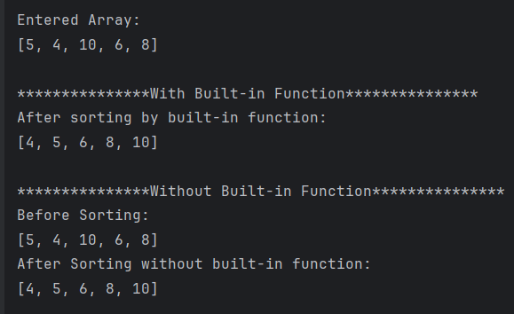

# Practical 1

## 🎯 Aim
Develop a Kotlin program for demonstrating various programming concepts.

## 📖 Description
This practical demonstrates the fundamental programming concepts in Kotlin by developing small programs.
Kotlin, being a modern and concise language for Android development, supports features like variables, data types, operators, control structures (if-else, when, loops), functions, classes, and collections.
By implementing these concepts in Kotlin programs, we gain a clear understanding of how logic is written, structured, and executed in Android applications as well as in general-purpose programming.

---

## 📋 List of Practicals

| No. | Screenshot | Aim |
|-----|------------|-----|
| 1 |  | To create a simple **Hello World** application. |
| 2 |  | To demonstrate the use of **Linear Layout**. |
| 3 |  | To demonstrate the use of **Relative Layout**. |
| 4 |  | To demonstrate the use of **Constraint Layout**. |
| 5 |  | To create a UI with **TextView, EditText, and Button**. |
| 6 |  | To implement **event handling** for Button clicks. |
| 7 |  | To design a **Login form** using basic UI components. |
| 8 |  | To demonstrate the **Activity Life Cycle** using Toast/Log messages. |
| 9 |  | To create an application that uses **ImageView and ScrollView**. |
| 10 |  | To demonstrate the use of **multiple Activities** and navigation. |
| 11 |  | To integrate and demonstrate concepts from previous practicals in a single mini project. |

---

## ✅ Conclusion
The Kotlin program was successfully developed to demonstrate various programming concepts such as variables, data types, control structures, functions, and object-oriented features.
This practical helped in understanding the fundamentals of Kotlin programming and how these concepts can be applied in developing Android as well as general-purpose applications.

