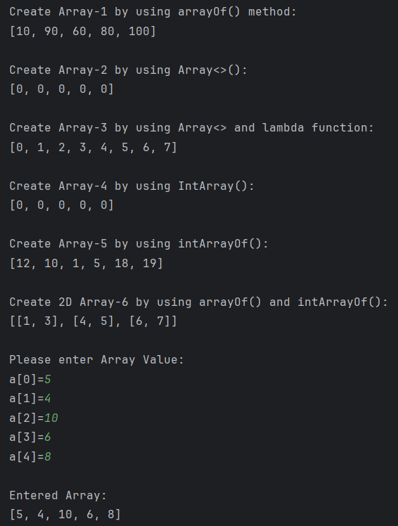

# Practical 1

## 🎯 Aim
Develop a Kotlin program for demonstrating various programming concepts.

## 📖 Description
This practical demonstrates the fundamental programming concepts in Kotlin by developing small programs.
Kotlin, being a modern and concise language for Android development, supports features like variables, data types, operators, control structures (if-else, when, loops), functions, classes, and collections.
By implementing these concepts in Kotlin programs, we gain a clear understanding of how logic is written, structured, and executed in Android applications as well as in general-purpose programming.

---

## 📋 List of Practicals

| No. | Screenshot | Aim |
|-----|------------|-----|
| 1 |  | Program demonstrates how to declare variables of various data types in Kotlin (Int, Double, Float, Long, Short, Byte, Char, Boolean, String) and display their values. |
| 2 |  | This program shows conversion of one data type into another, such as Int → Double, String → Int, and String → Double using Kotlin type conversion functions. |
| 3 |  | Takes input of student details like name, enrollment number, and branch, then displays the entered information. |
| 4 |  | Checks whether a given number is odd or even using control flow inside println() statement. |
| 5 |  | Uses Kotlin when expression to display the month name according to the number entered by the user (1–12). |
| 6 |  | Implements a custom function to perform basic arithmetic operations (addition, subtraction, multiplication, division) on two numbers. |
| 7 |  | Uses recursion to calculate the factorial of a given number by repeatedly calling the function until the base condition is met. |
| 8 |  | Explores array operations like Arrays.deepToString(), contentDeepToString(), and joinToString(). Demonstrates array creation, looping with range/until/downTo, and sorting arrays with and without built-in functions. |
| 9 |  | Stores integers in an ArrayList and finds the maximum value using iteration and built-in functions. |
| 10 |  | Defines a Car class with attributes like type, model, price, owner, and miles driven. Implements methods to display car info, calculate original price, and compute depreciated price. |
| 11 |  | Demonstrates Kotlin operator overloading by defining a Matrix class that supports matrix addition, subtraction, and multiplication. The toString() method is overloaded for formatted matrix output. |

---

## ✅ Conclusion
The Kotlin program was successfully developed to demonstrate various programming concepts such as variables, data types, control structures, functions, and object-oriented features.
This practical helped in understanding the fundamentals of Kotlin programming and how these concepts can be applied in developing Android as well as general-purpose applications.

